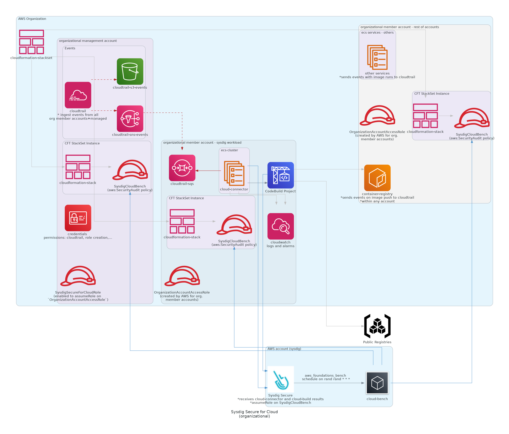

# Example: Organizational Cloudvision

- AWS Organization usage approach, where all the member accounts will report to a single `Organizational Cloudtrail`
- When an account becomes part of an organization, AWS will create an `OrganizationAccountAccessRole` [for account management](https://docs.aws.amazon.com/organizations/latest/userguide/orgs_manage_accounts_access.html), which cloudvision module will use for member-account provisioning
- In the Cloudvision member account
    - An additional role `SysdigCloudvisionRole` will be created within the master account, to be able to read s3 bucket events
    - All the cloudvision service-related resources will be created
    - Cloudwatch `cloud-connect` logs and event-alerts files will be generated



## Prerequisites

Minimum requirements:

1.  Have an existing AWS account as the organization master account
    - organzational cloudTrail service must be enabled
1.  AWS profile credentials configuration of the `master` account of the organization
    - this account credentials must be [able to manage cloudtrail creation](https://docs.aws.amazon.com/awscloudtrail/latest/userguide/creating-trail-organization.html)
      > You must be logged in with the management account for the organization to create an organization trail. You must also have sufficient permissions for the IAM user or role in the management account to successfully create an organization trail.
    - cloudvision organizational member account id, as input variable value
        ```
       cloudvision_member_account_id=<ORGANIZATIONAL_CLOUDVISION_ACCOUNT_ID>
        ```
1. Secure requirements, as input variable value
    ```
    sysdig_secure_api_token=<SECURE_API_TOKEN>
    ```

## Usage

For quick testing, use this snippet on your terraform files

```terraform
module "cloudvision_aws_organizational" {
  source = "github.com/sysdiglabs/terraform-aws-cloudvision//examples/organizational"

  sysdig_secure_api_token           = "00000000-1111-2222-3333-444444444444"
  cloudvision_member_account_id     = "<ORG_MEMBER_ACCOUNT_FOR_CLOUDVISION>"
}
```

See main module [`variables.tf`](./variables.tf) or [inputs summary](./README.md#inputs) file for more optional configuration.

To run this example you need have your [aws master-account profile configured in CLI](https://docs.aws.amazon.com/cli/latest/userguide/cli-configure-profiles.html) and to execute:
```terraform
$ terraform init
$ terraform plan
$ terraform apply
```

Note that:
  - This example will create resources that cost money. Run `terraform destroy` when you don't need them anymore
  - For more detailed configuration inspect both main module and example input variables
  - All created resources will be created within the tags `product:sysdig-cloudvision`, within the resource-group `sysdig-cloudvision`


---


<!-- BEGINNING OF PRE-COMMIT-TERRAFORM DOCS HOOK -->
## Requirements

| Name | Version |
|------|---------|
| <a name="requirement_terraform"></a> [terraform](#requirement\_terraform) | >= 0.15.0 |
| <a name="requirement_aws"></a> [aws](#requirement\_aws) | >= 3.50.0 |

## Providers

| Name | Version |
|------|---------|
| <a name="provider_aws.member"></a> [aws.member](#provider\_aws.member) | >= 3.50.0 |

## Modules

| Name | Source | Version |
|------|--------|---------|
| <a name="module_cloudvision"></a> [cloudvision](#module\_cloudvision) | ../../ |  |
| <a name="module_cloudvision_role"></a> [cloudvision\_role](#module\_cloudvision\_role) | ../../modules/infrastructure/organizational/cloudvision-role |  |
| <a name="module_resource_group_cloudvision_member"></a> [resource\_group\_cloudvision\_member](#module\_resource\_group\_cloudvision\_member) | ../../modules/infrastructure/resource-group |  |

## Resources

| Name | Type |
|------|------|
| [aws_iam_role.task](https://registry.terraform.io/providers/hashicorp/aws/latest/docs/resources/iam_role) | resource |
| [aws_iam_policy_document.task_assume_role](https://registry.terraform.io/providers/hashicorp/aws/latest/docs/data-sources/iam_policy_document) | data source |

## Inputs

| Name | Description | Type | Default | Required |
|------|-------------|------|---------|:--------:|
| <a name="input_cloudvision_member_account_id"></a> [cloudvision\_member\_account\_id](#input\_cloudvision\_member\_account\_id) | the account\_id **within the organization** to be used as cloudvision account | `string` | n/a | yes |
| <a name="input_sysdig_secure_api_token"></a> [sysdig\_secure\_api\_token](#input\_sysdig\_secure\_api\_token) | Sysdig Secure API token | `string` | n/a | yes |
| <a name="input_cloudtrail_org_is_multi_region_trail"></a> [cloudtrail\_org\_is\_multi\_region\_trail](#input\_cloudtrail\_org\_is\_multi\_region\_trail) | testing/economization purpose. true/false whether cloudtrail will ingest multiregional events | `bool` | `true` | no |
| <a name="input_cloudtrail_org_kms_enable"></a> [cloudtrail\_org\_kms\_enable](#input\_cloudtrail\_org\_kms\_enable) | testing/economization purpose. true/false whether s3 should be encrypted | `bool` | `true` | no |
| <a name="input_connector_ecs_task_role_name"></a> [connector\_ecs\_task\_role\_name](#input\_connector\_ecs\_task\_role\_name) | Name for the ecs task role. This is only required to resolve cyclic dependency with organizational approach | `string` | `"sysdig-cloudvision-connector-ECSTaskRole"` | no |
| <a name="input_name"></a> [name](#input\_name) | Name to be assigned to all child resources | `string` | `"sysdig-cloudvision"` | no |
| <a name="input_region"></a> [region](#input\_region) | Default region for resource creation in both organization master and cloudvision member account | `string` | `"eu-central-1"` | no |
| <a name="input_sysdig_secure_endpoint"></a> [sysdig\_secure\_endpoint](#input\_sysdig\_secure\_endpoint) | Sysdig Secure API endpoint | `string` | `"https://secure.sysdig.com"` | no |
| <a name="input_tags"></a> [tags](#input\_tags) | sysdig cloudvision tags | `map(string)` | <pre>{<br>  "product": "sysdig-cloudvision"<br>}</pre> | no |

## Outputs

No outputs.
<!-- END OF PRE-COMMIT-TERRAFORM DOCS HOOK -->

---

## Authors

Module is maintained by [Sysdig](https://sysdig.com).

## License

Apache 2 Licensed. See LICENSE for full details.
